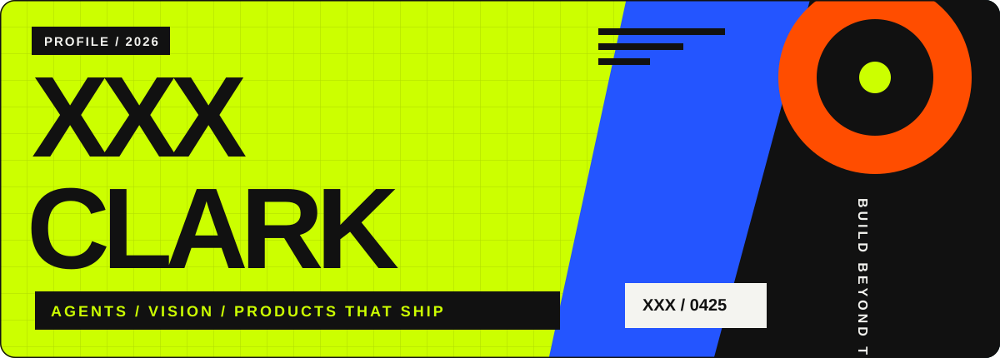

<div align="center">
  <a href="https://xxx-0425.github.io">
    
  </a>
</div>

<br/>

<div align="center">
  <a href="https://xxx-0425.github.io"></a>
  <a href="mailto:clarkakaxxx@gmail.com"></a>
  <a href="https://bento.me/xxx-0425"></a>
</div>

<br/>

```console
zq@earth ~ % whoami
张强 / Zhang Qiang — M.S. in CS @ CQUT (2024 → 2027)

zq@earth ~ % cat focus.txt
agents/    LangGraph 工作流编排 · RAG · 多步检索与反思
vision/    裂缝分割 · Mamba / Transformer · 两篇论文在审
shipping/  Spring Boot · FastAPI · Vue — 小程序「LuYea户外」已上线运营

zq@earth ~ % uptime
 coding since 2020, reads English docs for fun, ships things that run
```

<br/>

## ⚡ Projects

<table>
  <tr>
    <td width="50%" valign="top">
      <h3 align="center">🔍 InsightForge</h3>
      <p align="center"><sub>多源智能调研 Agent</sub></p>
      <p>基于 <b>LangGraph</b> 的调研工作流:问题分析 → Web/RAG 混合检索 → 相关性评分与低质过滤 → 不足时<b>自动补充检索</b> → SSE 流式生成带引用来源的研报。</p>
      <p align="center">
        
        
        
        
        
      </p>
    </td>
    <td width="50%" valign="top">
      <h3 align="center">🏕 漉野户外</h3>
      <p align="center"><sub>已上线运营的交易与装备租赁平台</sub></p>
      <p>独立交付的完整商业项目:小程序 + 管理后台 + 服务端。<b>微信支付 V3</b> 回调验签/防重/退款闭环,事务化库存扣减回补,团购原子并发控制与定时任务调度。</p>
      <p align="center">
        
        
        
        
        
      </p>
    </td>
  </tr>
  <tr>
    <td colspan="2" valign="top">
      <h3 align="center">📄 MAC-Net &amp; LDSCNet <sub><i>(under review)</i></sub></h3>
      <p align="center">两篇路面裂缝分割论文 — Mamba 辅助特征提取的频域增强网络 / 面向边缘设备的轻量化方向条带耦合网络
      <br/>
      
      
      
      </p>
    </td>
  </tr>
</table>

<br/>

## 📊 Stats

<div align="center">
  
  
</div>

<div align="center">
  
</div>

<div align="center">
  <sub><i>「 build agents that think · ship systems that run 」</i></sub>
</div>
